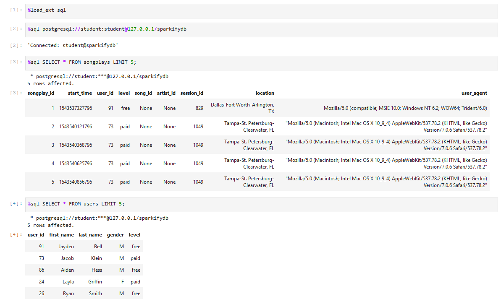
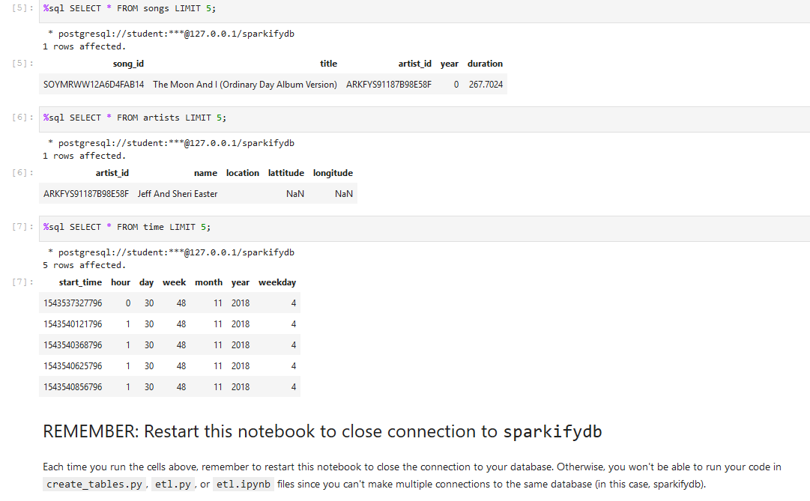

# Data Modeling with Postgres
## Project Overview
### Introduction
A startup called Sparkify wants to analyze the data they've been collecting on songs and user activity on their new music streaming app. The analytics team is particularly interested in understanding what songs users are listening to. Currently, they don't have an easy way to query their data, which resides in a directory of JSON logs on user activity on the app, as well as a directory with JSON metadata on the songs in their app.

They'd like a data engineer to create a Postgres database with tables designed to optimize queries on song play analysis, and bring you on the project. Your role is to create a database schema and ETL pipeline for this analysis. We'll be able to test your database and ETL pipeline by running queries given to us by the analytics team from Sparkify and compare your results with their expected results.

### Project Description
In this project, we'll apply what we've learned on data modeling with Postgres and build an ETL pipeline using Python. To complete the project, we will need to define fact and dimension tables for a star schema for a particular analytic focus, and write an ETL pipeline that transfers data from files in two local directories into these tables in Postgres using Python and SQL

### Dataset:
#### Song Dataset
The first dataset is a subset of real data from the Million Song Dataset. Each file is in JSON format and contains metadata about a song and the artist of that song. The files are partitioned by the first three letters of each song's track ID. For example, here are filepaths to two files in this dataset.

#### Log Dataset
The second dataset consists of log files in JSON format generated by this event simulator based on the songs in the dataset above. These simulate app activity logs from a music streaming app based on specified configurations.

The log files in the dataset you'll be working with are partitioned by year and month. For example, here are filepaths to two files in this dataset.

### Schema for Song Play Analysis
Using the song and log datasets, we'll be creating a star schema optimized for queries on song play analysis. This includes the following tables.

#### Fact Table
1. songplays - records in log data associated with song plays i.e. records with page NextSong
songplay_id, start_time, user_id, level, song_id, artist_id, session_id, location, user_agent
#### Dimension Tables
2. users - users in the app
user_id, first_name, last_name, gender, level
3. songs - songs in music database
song_id, title, artist_id, year, duration
4. artists - artists in music database
artist_id, name, location, lattitude, longitude
5. time - timestamps of records in songplays broken down into specific units
start_time, hour, day, week, month, year, weekday

In addition to the data files, the project workspace includes six files: description below

1. test.ipynb displays the first few rows of each table to let you check your database.
2. create_tables.py drops and creates your tables. You run this file to reset your tables before each time you run your ETL scripts.
3. etl.ipynb reads and processes a single file from song_data and log_data and loads the data into your tables. This notebook contains detailed instructions on the ETL process for each of the tables.
4. etl.py reads and processes files from song_data and log_data and loads them into your tables. You can fill this out based on your work in the ETL notebook.
5. sql_queries.py contains all your sql queries, and is imported into the last three files above.
6. README.md provides discussion on your project.

### Instructions:
1. Run the following commands in the project's root directory via jupyter notebook

    - To create the database and star scheme tables for ETL pipeline that cleans data and stores in database
        `%run create_tables.py`
    - To run ETL pipeline 
        `%run etl.py`
2. Run the test.ipynb to test the results

### RESULTS

